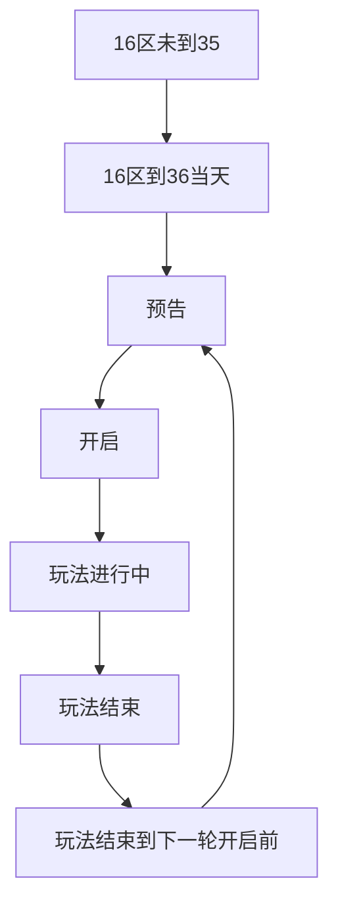
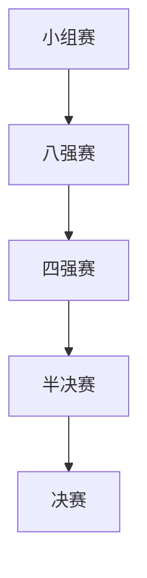

## 变更历史
| 版本 | 内容 | 修改人 | 日期 |
| :--: | :--: | :--: | :--: |
| 1.0.0 | 初版至尊武道会设计 | 黄威 | 2024年2月21日09:36:15 |
## 需求描述

1. 
## 功能拆分

- 游戏主玩法
- 至尊殿堂
- 至尊榜
- 排行榜
- 主城界面添加入口
- 探索界面添加提示信息
- 异界战场添加入口
- 荣耀殿堂
- 5v5布阵功能
- 至尊商店
- 竞猜打脸图
- 引导
- 红点需求
## 流程图
### 活动流程图

### 玩法流程图

## 接口设计
