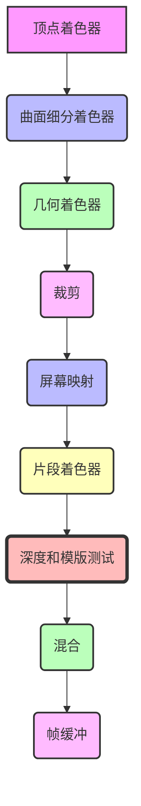

```mermaid
graph TD
    A[顶点着色器] --> B(曲面细分着色器)
    B --> C(几何着色器)
    C --> D(裁剪)
    D --> E(屏幕映射)
    E --> F(片段着色器)
    F --> G(深度和模版测试)
    G --> H(混合)
    H --> I(帧缓冲)
    
    style A fill:#f9f,stroke:#333,stroke-width:2px
    style B fill:#bbf,stroke:#333,stroke-width:2px
    style C fill:#bfb,stroke:#333,stroke-width:2px
    style D fill:#fbf,stroke:#333,stroke-width:2px
    style E fill:#bbf,stroke:#333,stroke-width:2px
    style F fill:#ffb,stroke:#333,stroke-width:2px
    style G fill:#fbb,stroke:#333,stroke-width:4px
    style H fill:#bfb,stroke:#333,stroke-width:2px
    style I fill:#fbf,stroke:#333,stroke-width:2px

```