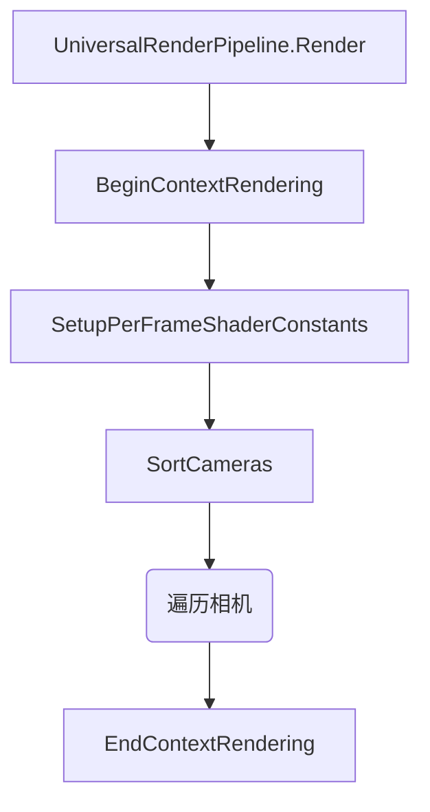

```mermaid
graph TD
	UniversalRenderPipeline.Render --> BeginContextRendering
	BeginContextRendering --> SetupPerFrameShaderConstants --> SortCameras --> Fcameras(遍历相机) --> EndContextRendering
```

**foreach (cameras)**

