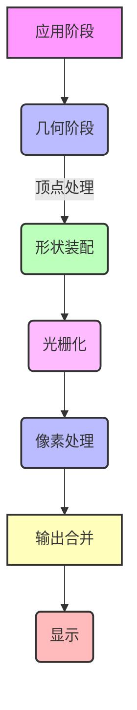
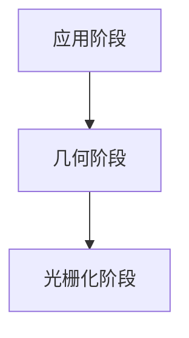
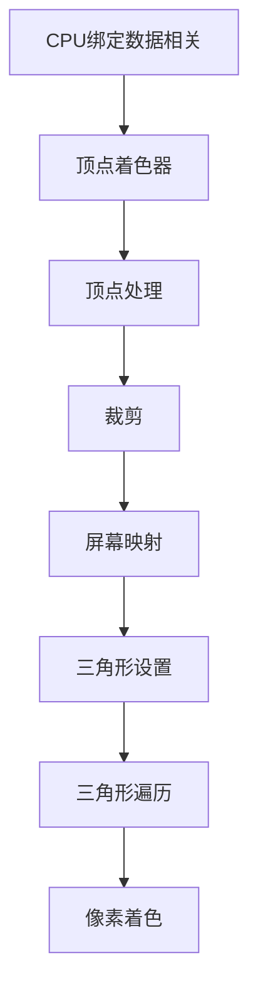

```mermaid
graph TD
    A[应用阶段] --> B(几何阶段)
    B -->|顶点处理| C(形状装配)
    C --> D(光栅化)
    D --> E(像素处理)
    E --> F[输出合并]
    F --> G(显示)
    
    style A fill:#f9f,stroke:#333,stroke-width:2px
    style B fill:#bbf,stroke:#333,stroke-width:2px
    style C fill:#bfb,stroke:#333,stroke-width:2px
    style D fill:#fbf,stroke:#333,stroke-width:2px
    style E fill:#bbf,stroke:#333,stroke-width:2px
    style F fill:#ffb,stroke:#333,stroke-width:2px
    style G fill:#fbb,stroke:#333,stroke-width:2px

```

```mermaid
graph TD
	A[应用阶段] --> B[几何阶段]
	B[几何阶段] --> C[光栅化阶段]	
```

```mermaid
graph TD
	A[CPU绑定数据相关] -->B[顶点着色器]
	B --> C[顶点处理]
	C --> D[裁剪]
	D --> E[屏幕映射]
	E --> F[三角形设置]
	F --> H[三角形遍历]
	H --> J[像素着色]
```